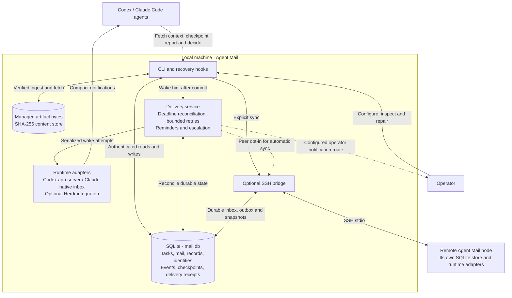

# Agent Mail

Local coordination for **Codex and Claude Code**. Assign tasks, exchange messages,
and recover unfinished work after a context reset.

Agent Mail keeps tasks, decisions and pending requests in SQLite. Connected agents
receive small notifications and fetch details when needed. No account or hosted service.


## Architecture

One local binary provides the CLI, delivery service, and optional SSH bridge.
Each machine keeps its own store; groups share that store and service while
keeping their tasks, identities, and inboxes separate.



SQLite holds the authoritative coordination state; managed artifact bytes live
on local disk. The service recovers pending work from persisted events and
deadlines after restart. Agents fetch details on demand, and the task writer
records decisions: a notification, delivery receipt, or status reply does not
complete work. Approval holds remain in place during escalation.

See [minimal continuation](docs/MINIMAL_CONTINUATION.md),
[artifacts](docs/artifacts.md), and [task coordination](docs/task-coordination.md)
for scheduling, storage, and authority details.

## Install

Install the CLI and its agent skill:

```sh
brew install youssef-tharwat/tap/agent-mail
npx skills add youssef-tharwat/agent-mail --skill agent-mail -g
```

Prebuilt binaries support macOS and Linux on ARM64 and x86-64. No Rust compiler
needed. [Other installation options](docs/usage.md#install).

## Start a project

Create a group for your project or fleet. Follow-through is enabled by default:

```sh
agent-mail init my-fleet
```

Launch each agent in its own terminal, using that same group:

```sh
# Terminal 1
agent-mail --group my-fleet run coordinator -- codex

# Terminal 2
agent-mail --group my-fleet run worker -- claude
```

`run` registers the agent, supplies the skill and recovery hooks, and starts the
local delivery worker when needed. Follow the client's normal trust prompts.
Groups keep their agents, tasks and inboxes separate while sharing the local store.
Use the same group and store for every agent in the fleet. To create a group in
observation mode, use `agent-mail init my-fleet --no-follow-through`: it records
attention state without sending follow-up reminders or escalations. Running plain
`init` for an existing group preserves its policy.

## Assign work and get a result

Ask the coordinator to use Agent Mail, or run this inside its session:

```sh
agent-mail task create api-review "Review the API changes" --owner worker
```

The worker receives the assignment and reports its result:

```sh
agent-mail mail send coordinator "API review complete" \
  --task api-review --key api-review-result --body-file reviews/api.md
```

The coordinator records the next action or decision on the task. The creator owns
those decisions; the assigned worker does the work. Receiving a message never
marks a task complete. [Full assignment and review flow](docs/agent-guide.md#assignment--result--decision).

## Recover, follow, or wait

```sh
agent-mail context                  # Current assignments and pending requests
agent-mail watch                    # Stream changes; fetch details as needed
agent-mail mail wait 42 --timeout 5m # Wait for a request's reply or settlement
```

`watch` emits compact batches with a resume cursor. Continue with
`agent-mail watch --after CURSOR`. `mail wait` uses the event stream; it does not
poll or resolve the request. [Streaming and waiting](docs/agent-guide.md#follow-changes-and-wait-for-a-reply).

## Keep unfinished work visible

Follow-through tracks pending tasks and requests and asks agents to record an
outcome or a concrete next step. Reading a notification or acknowledging delivery
does not count as handling the work. Agents can checkpoint unfinished work with
its next action, a dependency or approval hold, and a review time. The work remains
pending until an ordinary task decision or mail outcome settles it.

The existing service schedules the next check from durable task and checkpoint
state. Ending a turn or replying with status leaves unfinished work pending.
After a restart, the service reconciles the same deadlines. It sends bounded
reminders, then escalates unresolved work to the task writer or request sender.
Blocked and review tasks escalate for a decision without worker reminders.

Wake attempts are serialized per participant. Reserved native wakes without a
confirmed receipt remain visible in status, including after restart; fresh events
cannot bypass their retry delay. Delivery acceptance never completes work.

Configure a group's policy directly from the CLI:

```sh
agent-mail --group my-fleet attention configure --enable --interval 15m --max 1h
```

Options update only the settings you specify. Use `--observe` to stop follow-up
dispatch while retaining its history. JSON remains an optional import format via
`attention configure --file policy.json`.

Escalations go to the task writer or request sender, then to the operator if they
remain unhandled. Herdr provides an operator notification route. For a standalone
fleet, point Agent Mail at your notification program:

```sh
agent-mail --group my-fleet attention configure --notifier /absolute/path/notify-operator
```

Replace the path with an executable that accepts an alert as JSON on stdin. Add
arguments with repeated `--notifier-arg VALUE` options; use `--clear-notifier` to
remove the override. Without an operator route, status reports `unconfigured`.
An approval hold remains a hold until the responsible person authorizes the action.

See [minimal continuation and acceptance evidence](docs/MINIMAL_CONTINUATION.md).

See [follow-through configuration and checkpoints](docs/usage.md#follow-through-after-delivery)
for policy options, wait conditions, and operator notifications.

## Check delivery

```sh
agent-mail status
```

```text
coordinator  Ready
worker       Verifying · retry in 42s
```

**Ready** means the agent acknowledged a delivery check and its connection is
healthy; it does not mean its assignments are finished. If delivery is unavailable,
work stays pending. Use
`agent-mail status --check worker` to diagnose the cause, then
`agent-mail agent retry worker` after fixing it. [Delivery and repair](docs/usage.md#delivery-verification-08).

Agents react to notifications; they do not poll. Agent Mail owns retries and
recovery. New actionable changes restart bounded delivery attempts automatically;
reading a notification's records leaves business decisions pending. Coordinators
still own review decisions and authorization of the next step.

## Commands

| Purpose | Commands |
|---|---|
| Set up | `init`, `run` |
| Coordinate | `context`, `task`, `mail`, `watch`, `attention` |
| Inspect and repair | `status`, `agent` |
| Configure integrations | `runtime`, `service` |

Use `agent-mail COMMAND --help` for options. Task and mail commands return JSON.
Use `--group NAME` outside a managed session when group selection is needed.

## Herdr integration

Herdr is optional. To coordinate agents already running in Herdr panes, install
its delivery plugin and follow the [Herdr setup guide](docs/usage.md#optional-herdr-integration):

```sh
herdr plugin install youssef-tharwat/agent-mail
```

Pane binding also requires Herdr's agent integration to report the native session
identity. The standalone launches above work without Herdr. Your workflow defines
review and acceptance rules; Fleet Campaign is optional too.

## Documentation

[Agent operating guide](docs/agent-guide.md) · [User guide](docs/usage.md) ·
[Architecture](docs/ARCHITECTURE.md) · [Development](docs/usage.md#development) ·
[Issues](https://github.com/youssef-tharwat/agent-mail/issues)

Update with `brew upgrade youssef-tharwat/tap/agent-mail`. Existing stores migrate
automatically on the next use, with a verified backup and worker handoff. The skill loads the
installed binary's instructions on its next invocation. [Skill updates](docs/usage.md#agent-skill).

Maintained by [Youssef Tharwat](https://github.com/youssef-tharwat). [MIT](LICENSE).

### Shared coordination register

Group records preserve immutable, addressable revisions for contracts, briefs and
decisions. Typed artifacts store metadata in SQLite and original bytes in a
managed SHA-256 content store with selective Zstandard compression. Explicit task
relationships and all/any checkpoint prerequisites support recovery without
parsing task names. Writer handoffs require observed versions and audited reasons.

```sh
agent-mail record create --file contract.json
agent-mail record show contract --revision 1
agent-mail artifact ingest --file evidence.json --input test.log
agent-mail artifact check evidence
agent-mail task list --all-states
agent-mail task history lane --limit 20
agent-mail task messages lane --limit 20
agent-mail task relations lane
agent-mail task transfer-writer lane --file transfer.json
```

See [records](docs/records.md), [artifacts](docs/artifacts.md), and
[task coordination](docs/task-coordination.md) for formats, authority, pagination,
retention and backup policies. Recovery stays bounded; full contents and audit
pages are fetched on demand. None of these reads accepts work or resolves mail.
