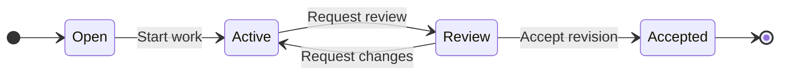
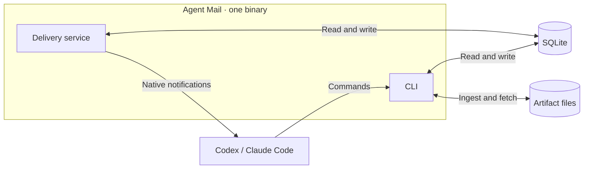

# Agent Mail

Local coordination for **Codex and Claude Code**. Assign tasks, exchange messages,
and recover unfinished work after a context reset. One binary, local SQLite,
no account or hosted service.

## Task review cycle



The task writer records each transition; the assigned owner does the work and
submits results through mail.

## Quick start

Install the CLI and its agent skill:

```sh
brew install youssef-tharwat/tap/agent-mail
npx skills add youssef-tharwat/agent-mail --skill agent-mail -g
```

Prebuilt binaries support macOS and Linux on ARM64 and x86-64.
[Other installation options](docs/usage.md#install).

Create a project group, then launch each agent in its own terminal:

```sh
agent-mail init my-fleet

# Terminal 1
agent-mail --group my-fleet run coordinator -- codex

# Terminal 2
agent-mail --group my-fleet run worker -- claude
```

`run` registers the agent, supplies recovery hooks and instructions, and starts
the delivery service. Use the same group and store for every agent.

Inside the coordinator's session, assign work:

```sh
agent-mail task create api-review "Review the API changes" --owner worker
```

The worker receives a notification and reports back:

```sh
agent-mail mail send coordinator "API review complete" \
  --task api-review --version 1 --key api-review-result --body-file reviews/api.md
```

The coordinator records the decision. A reply alone leaves the task pending.
Every send requires a task and observed version, an existing conversation, a
parent message, or `--new-conversation`. Replies inherit their parent's context.
[Mail contexts and private conversations](docs/MAIL_CONTEXT.md).
[Full assignment and review flow](docs/agent-guide.md#assignment--result--decision).

## Follow-through

New groups enable follow-through by default. The service resumes unfinished
work at persisted checkpoint deadlines, including after restart, and escalates
unresolved work to its task writer or request sender. Approval and review holds
remain in place; due checks alert the decision owner.

```sh
agent-mail --group my-fleet attention configure --interval 15m --max 1h
```

Use `--observe` to retain diagnostics without dispatching reminders. Operator
alerts require a configured notification route.
[Checkpoints, policies, and notifications](docs/usage.md#follow-through-after-delivery) ·
[Continuation evidence](docs/MINIMAL_CONTINUATION.md).

## Everyday commands

```sh
agent-mail context                  # Recover assignments and pending requests
agent-mail attention snapshot       # Inspect current reasons for attention
agent-mail watch --attention         # Observe attention without claiming delivery
agent-mail mail wait 42 --timeout 5m # Wait for a reply or settlement
agent-mail status                   # Inspect delivery health
```

Use `mail send --intent notice` for quiet information. `mail reply` resolves the
incoming request and returns a response for inspection without requiring another
reply. Mail waits can require `--until all-settled` for a fan-out request.

**Ready** in status means delivery is verified. Task completion requires a writer
decision. [Delivery and repair](docs/usage.md#delivery-verification-08).

| Purpose | Commands |
|---|---|
| Tasks and messages | `task`, `mail`, `attention` |
| Shared records and evidence | `record`, `artifact` |
| Agent management | `agent`, `run` |
| Integration controls | `runtime`, `service` |

Use `agent-mail COMMAND --help` for options, and `--group NAME` outside a managed
session when group selection is needed.

## Local architecture



The CLI and service share a local SQLite store. Managed artifact bytes live in
local files. The CLI remains usable while the delivery service is stopped.

## Communication

Agents exchange durable mail and task records. Runtime notifications tell them
when to fetch that state.

| Path | Mechanism | What to expect |
|---|---|---|
| Mail and tasks | Authenticated CLI commands commit to local SQLite | A successful write is durable. Reading a request leaves it pending. |
| Codex notifications | Local Unix socket to the app-server; native queue or targeted steer | The receipt confirms runtime acceptance. The agent still needs to fetch details and act. |
| Claude Code notifications | Native inbox over a local Unix socket, with recovery hooks | A matching authenticated hook confirms admission. Missing receipts stay visibly unconfirmed. |
| `watch` and `mail wait` | Private Unix event stream backed by persisted events | Changes stream without agent polling; cursors support replay after reconnect. |
| Herdr delivery (optional) | Local socket RPC to a verified agent pane | Wake prompts follow runtime safety checks. Unavailable delivery leaves work pending. |
| Between machines (optional) | SSH stdio between nodes with separate stores | Explicit sync or opted-in automatic sync transfers durable records. Offline sends stay queued; managed artifact bytes remain local. |

Notifications use bounded retries and may repeat after an uncertain delivery.
Completion and acceptance require explicit decisions.
[Delivery details](docs/usage.md#delivery-verification-08).

## Guides

[Agent operating guide](docs/agent-guide.md) · [User guide](docs/usage.md) ·
[Herdr integration](docs/usage.md#optional-herdr-integration) ·
[Development](docs/usage.md#development)

[Shared records](docs/records.md) · [Artifact storage](docs/artifacts.md) ·
[Task relationships and writer handoffs](docs/task-coordination.md)

Update with `brew upgrade youssef-tharwat/tap/agent-mail`. Existing stores migrate
automatically with a verified backup.

Maintained by [Youssef Tharwat](https://github.com/youssef-tharwat). [MIT](LICENSE) ·
[Issues](https://github.com/youssef-tharwat/agent-mail/issues).
